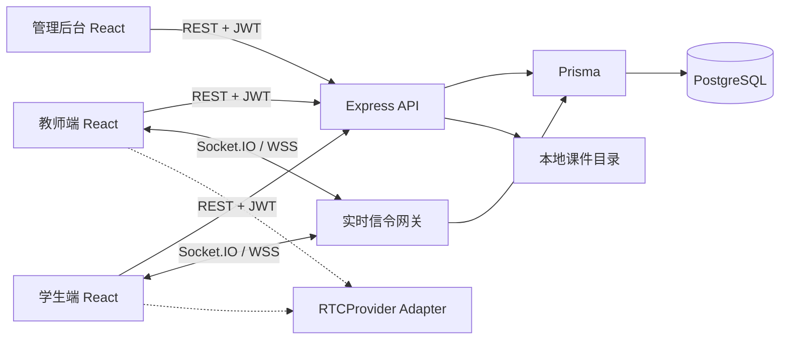

# 系统架构

## 1. 目标与边界

MVP 优先验证“教学内容为主屏 + 轻量音视频 + 实时引导与奖励”。不实现 Android 强锁屏、录课、计费、家长端、AI 助手和复杂屏幕共享。

## 2. 逻辑架构

前端通过 workspace 包共享类型。`packages/types` 是 WebSocket 消息结构和 action 的唯一事实来源；任何新增 action 必须先在此登记。

## 3. 模块职责

- `auth`：密码校验、12 小时 JWT、REST/Socket 双重身份验证。
- `users`：管理员创建账号；教师只读取已分配给自己的学生。
- `classes`：房间生命周期、教师所有权、学生成员授权。
- `courseware`：MVP 本地图片/PDF 上传；生产环境替换为 OSS/S3 的预签名上传。
- `websocket`：验证信令结构、角色、房间归属和目标学生，转发并持久化。
- `whiteboard`：按页保存笔画，使用 `[0,1]` 比例坐标重绘。
- `rtc`：业务无关接口；当前为占位实现。

## 4. 授权规则

| 操作 | student | teacher | admin |
| --- | --- | --- | --- |
| 进入课堂 | 仅已分配成员 | 仅自己创建 | 可审计查看 |
| 白板/课件控制 | 否 | 仅自己的课堂 | 否 |
| 奖励/专注提醒 | 否 | 仅发给课堂内学生 | 否 |
| 页面状态上报 | 仅本人 | 否 | 否 |
| 创建账号/分组 | 否 | 否 | 是 |
| 查看日志 | 否 | 仅自己的课堂 | 全部 |

Socket 网关不信任客户端的 `from_uid`：必须与 JWT 中用户 ID 完全一致。带 `target_uid` 的消息还要验证目标学生属于当前课堂。

## 5. 数据与一致性

PostgreSQL 保存业务数据。每条合法信令写入 `SignalLog`；白板信令另写 `WhiteboardEvent`；奖励另写 `RewardLog`。客户端收到 Socket.IO ACK 才视为服务端已接受。`msg_id` 唯一，可避免重试造成重复日志。

MVP 的在线状态是瞬时状态，由房间内 Socket 广播，不作为永久学习结论。未来可接入 Redis 保存 presence、做多实例 Socket.IO adapter 和限流。

## 6. 白板设计

- Pointer 坐标除以 Canvas CSS 尺寸后再发送，范围钳制为 `[0,1]`。
- 重绘时按本机实际像素尺寸还原，兼容教师/学生不同分辨率。
- 每一页独立保存 stroke 数组；翻页不清除其他页。
- 橡皮使用 Canvas `destination-out`；撤销/重做以笔画为粒度。
- 课堂回放可按 `WhiteboardEvent.createdAt` 顺序重放。

## 7. RTC 替换点

`RTCProviderAdapter` 暴露 `join`、`leave`、`setCamera`、`setMicrophone`。生产接入时新增如 `AgoraRTCAdapter`，凭证由后端按房间权限短期签发，不把 App Certificate/Secret 写入前端。

## 8. 儿童隐私与权限

- 仅收集提供伴学服务必需的账号、年级与监护人联系信息；联系信息在管理后台默认脱敏。
- 请求摄像头/麦克风前展示用途、使用范围和关闭方式；拒绝后仍允许使用白板核心功能。
- 录音录像默认关闭。开启录课必须取得家长明确、可撤回的单独授权，并说明保存时长。
- 生产环境强制 TLS（HTTPS/WSS），密码使用强哈希，RTC token 与上传 URL 短期有效。
- 教师只能看到自己分组的学生，管理员采用最小权限；账号、分组、分配操作写审计日志。
- 日志 payload 不应写入聊天原文、联系方式、音视频内容等敏感数据；配置保留期限和删除机制。

## 9. 生产化差距

上线前还需补充：刷新令牌/撤销机制、CSRF 与速率限制、文件内容扫描、对象存储、Redis presence、消息队列、监控告警、数据库备份、数据导出/删除流程、家长同意记录、依赖与安全扫描。
